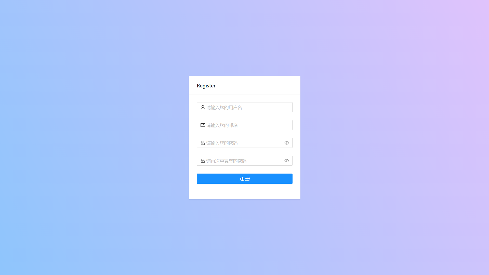
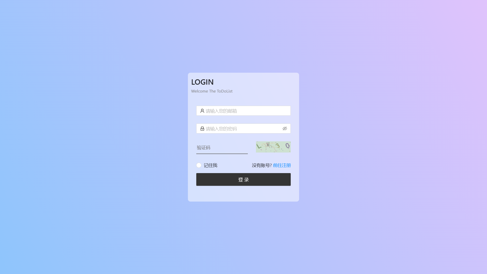
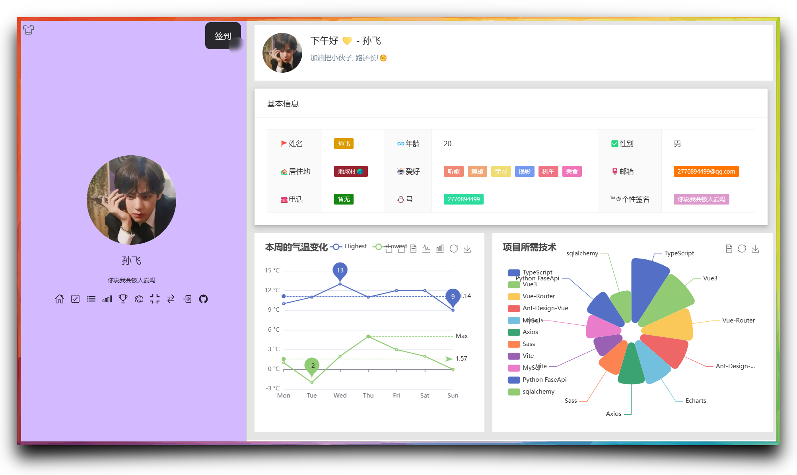
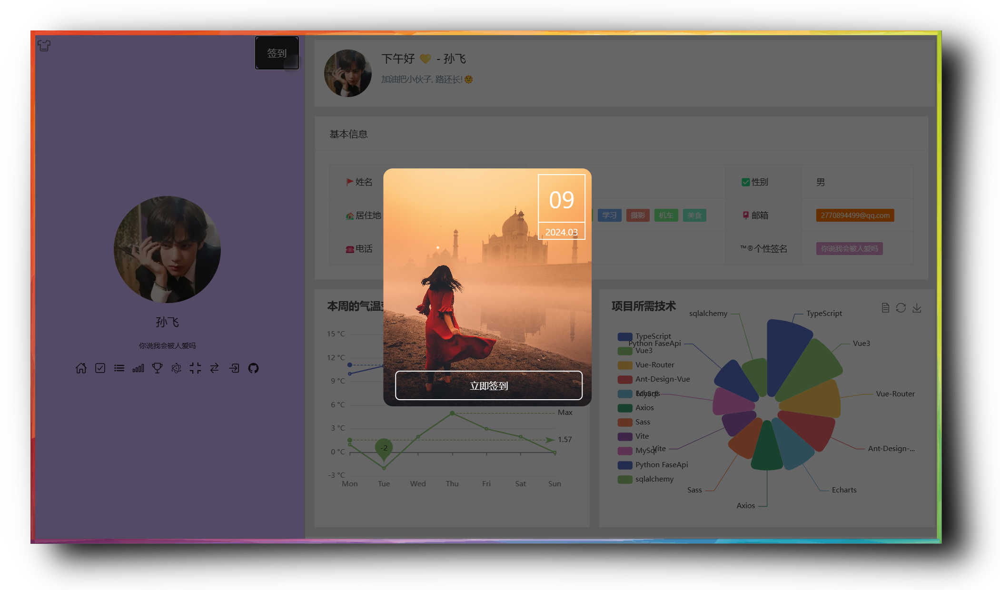
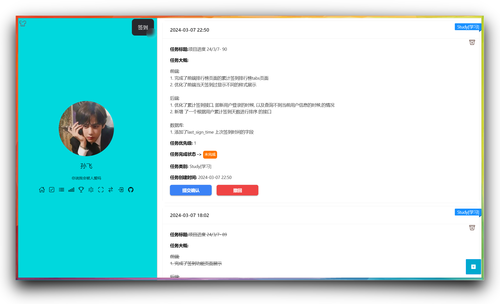
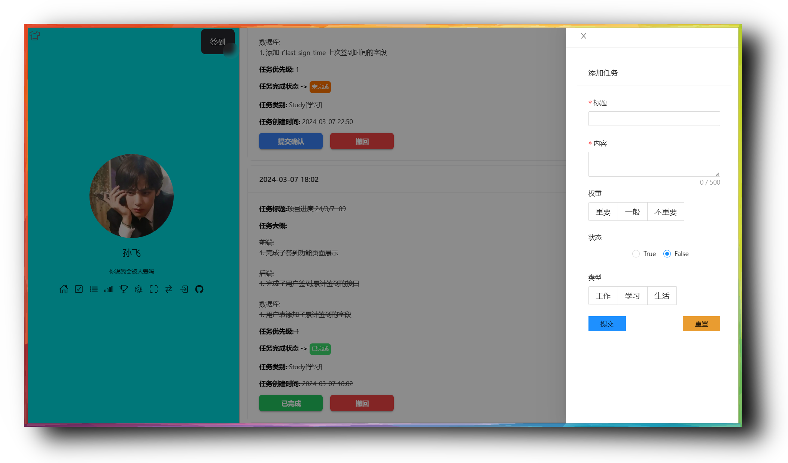
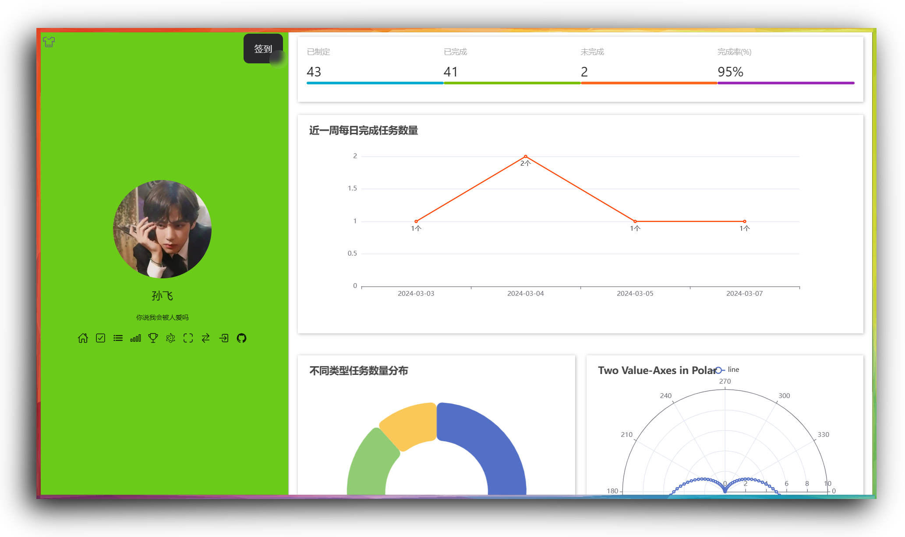
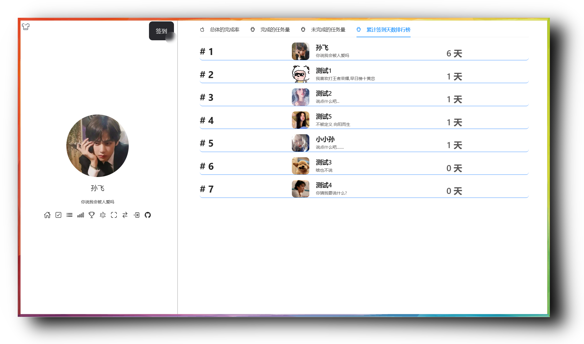
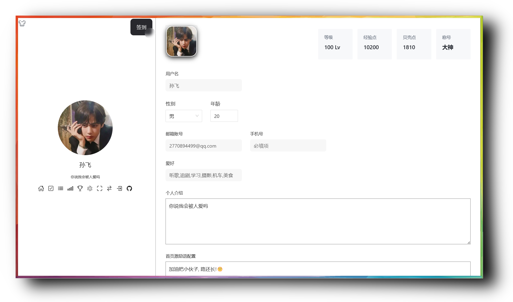

# TodoList 文档说明

## 1. 开发背景

todoList 项目的开发也算心血来潮. 由于平时自己喜欢记录事情, 比如什么时间段内做了什么事情,我习惯性地会去记录下. 通过这样不仅可以促进自己成长,也可以`不断反思完善自我`. 最重要的是 当看见记录了满满的一页, `收获满满的那种感觉`很令人"啄米".🤭

一般我记录事情, 会选择写在本地的md文件里面,也就是说每天都要打开电脑进行记录.这就需要每天打开电脑,而且不能随时随地的记录. 

当然市面上也有类似备忘录的一些软件,但是`功能要么收费`,要么`样式我不喜欢`...😩.

所以趁着当时正好学习了fastApi 一个Python 开发web服务的轻量级框架, 所以就心血来潮,准备开发一款自己喜欢的备忘录网站.

> FastAPI 是一个现代、快速（高性能）的 Web 框架，用于基于标准 Python 类型提示使用 Python 3.8+ 构建 API。

## 2. 项目介绍

**TodoList :** 

该网站的开发初衷, 是为了帮助用户`方便` 地记录当下的`想法`, `完成的事情`, `一些需要记录的事情` . 同时使用`可视化图形`更好的分析`不同类型任务的占比` , `任务的完成率`, `每天完成的任务数量`, 引入`等级`, `称号`, `经验值` , `贝壳点`,`排行榜`等 功能,激励用户`更好养成良好的时间管理习惯，提高工作效率`。

## 3. 项目模块介绍

1. **用户注册与登录**：用户可以使用`邮箱注册账号`，并通过`邮箱号 || 用户名,密码登录`。
2. **任务记录**：用户可以`创建任务`，并对任务进行`编辑、删除`。任务权重可分为：`重要`、`一般`、`不重要`。
3. **任务分类**：用户可以为任务设置分类，如`工作、学习、生活等`，便于管理。
4. **可视化图表**：根据任务类型、完成情况、每天完成的任务数量等数据，生成`直观的图表，方便用户分析`。
5. **等级与称号**：用户根据`完成任务的数量和质量`，获得`相应的等级和称号`。
6. **经验值与贝壳点**：用户可以通过`完成任务` , `每日签到` 可获得`经验值和贝壳点`，用于`解锁新功能 等级升级 `等。
7. **数据导出与备份**：用户可以导出自己的任务数据，进行`备份`或分享。
8. **排行榜**: 用户只要创建任务, 就可以参与到排行榜里面, 包括`完成率`, `完成的任务总量`, `未完成任务总量`, 排行榜
9. **个人信息** : 用户可以自定义一些信息, 包括`头像`,`性别`, `年龄`, `用户名`, `爱好` , `个人介绍` , `首页激励语` 信息

## 4. 项目展示

### 网页端展示

注册

登录

首页

签到

任务列表

制定任务

可视化面板

排行榜

个人信息

### 手机端展示

